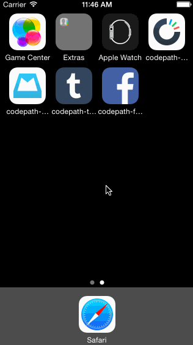

# Codepath Week 5: Facebook

### Description:
This is a fake Facebook iOS application that simulates the stock newsfeed experience with an emphasis on custom photo modal interactions.

### Time spent:
8.5 hours spent in total

### Completed user stories:
 * [x] Tapping on a photo in the news feed should expand the photo full screen.
 * [x] Tapping the Done button should animate the photo back into its position in the news feed.
 * [x] On scroll of the full screen photo, the background should start to become transparent, revealing the feed.
 * [x] If the user scrolls a large amount and releases, the full screen photo should dismiss.
 * [ ] Optional: The full screen photo should be zoomable.
 * [ ] Optional: The user should be able to page through the other photos in full screen mode.
 
### Notes:
Both of the images on the left-hand side of the newsfeed briefly switch their aspect-ratio at the beginning of the transition animation into the full-screen modal and I was unsure how to troubleshoot this.

### Walkthrough of all user stories:

GIF created with [LiceCap](http://www.cockos.com/licecap/).